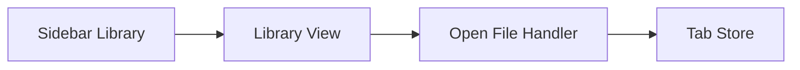

# Ryte Breadboarding

Use this skill to map a selected Ryte shape into concrete affordances, wiring, and demoable vertical slices.

## Ground Rules

- Tables are the source of truth. Diagrams are optional views derived from the tables.
- Every slice must end in visible, demoable app behavior.
- Avoid horizontal slices like "add all data models" or "refactor all CSS" unless they are hidden work inside a vertical slice.
- Preserve Ryte architecture boundaries:
  - Main process owns filesystem, SQLite/vector storage, providers, credentials, external links, and OS integration.
  - Preload exposes narrow typed operations.
  - Renderer owns UI state and calls preload APIs.
- Keep local-first behavior intact. Do not introduce network, sync, or provider calls unless the selected shape explicitly requires them.
- Use synthetic fixtures or UI smoke checks; do not validate against real note content unless explicitly approved.

## Breadboard Inputs

Start from one of:

- A selected shape from `ryte-shaping`
- A rough design with enough decisions to map
- An existing workflow that needs to be understood before changing it

If the input has unresolved `UNKNOWN` mechanisms, convert them into spikes before slicing unless the user asks for a provisional breadboard.

## Places

Group affordances by place. For Ryte, common places are:

- `P1 App Shell`
- `P2 Sidebar Navigation`
- `P3 Tab Strip`
- `P4 Command/Open View`
- `P5 Library View`
- `P6 Viewer Preview`
- `P7 Viewer Source`
- `P8 Settings`
- `P9 Main Process`
- `P10 Preload API`
- `S1 Local UI State`
- `S2 Local Persistence`
- `S3 SQLite Index`
- `S4 macOS Window`

Add or rename places to match the shaped feature. Stores use `S#`; screens/components/process boundaries use `P#`.

## UI Affordance Table

Use this format:

```markdown
## UI Affordances

| ID  | Place                 | Affordance   | Action / Display        | Wires Out | Returns To |
| --- | --------------------- | ------------ | ----------------------- | --------- | ---------- |
| U1  | P2 Sidebar Navigation | Library item | Opens all-files library | U1 -> U8  | P5         |
```

Include things the user can see, click, type into, toggle, collapse, select, close, or read. Skip purely decorative wrappers unless they control layout state.

## Code Affordance Table

Use this format:

```markdown
## Code Affordances

| ID  | Place             | Affordance | Responsibility                                     | Wires Out | Returns To |
| --- | ----------------- | ---------- | -------------------------------------------------- | --------- | ---------- |
| C1  | S1 Local UI State | tab store  | Tracks open tabs, active tab, close/select actions | C1 -> C4  | P3         |
```

Include state stores, IPC handlers, parser functions, persistence operations, main-process services, and preload API calls that are meaningful affordances. Do not create rows for internal helper details unless they carry a decision, side effect, or integration boundary.

## Wiring Rules

- Use IDs in `Wires Out`, for example `U4 -> C3 -> C7 -> S2`.
- Use `Returns To` for the place or affordance the user sees after completion.
- Show both navigation flow and data flow when they differ.
- Represent external/local stores explicitly, for example `localStorage`, Ryte settings JSON, SQLite, or Electron BrowserWindow state.
- If a wire crosses renderer/preload/main, make the boundary visible in the code affordance table.

## Optional Mermaid View

Only add a Mermaid diagram after the tables are coherent.



If the user changes the diagram, update the tables first and regenerate the diagram from them.

## Slicing

After the breadboard is stable, create vertical slices.

Slice format:

```markdown
## Slice V1: [Title]

### Demo

[What the user can see or do after this slice.]

### Included Affordances

- U1, U2, C1, C2, S1

### Implementation Notes

- [Files/modules likely touched]

### Validation

- [Automated checks]
- [Manual smoke]

### Out of Scope

- [Explicitly excluded work]
```

Slicing guidelines:

- Start with the minimum shell that proves the new state model.
- Prefer slices that can merge independently.
- Put risky unknowns before dependent polish.
- Keep labels, profile, agents, sync, writable editing, and provider behavior out unless selected by the shape.
- Include docs/version/progress-note updates in the final or relevant slice.

## Output Expectations

- Produce a breadboard document path and concise summary.
- Present complete UI and Code affordance tables.
- Include a short list of unresolved unknowns.
- Include vertical slices with demo outcomes and validation.
- Recommend the next branch/PR boundary.
